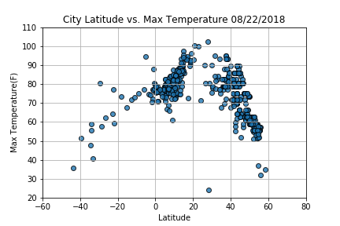

# What's the weather like as we approach the equator? 

Whether financial, political, or social -- data's true power lies in its ability, I know what you may be thinking: "Obviously. It gets hotter..."But, if pressed, how would I prove it?

For this analysis I have created a simple Python script to visualize the weather of 500+ cities across the 	world of varying distance from the equator. To accomplish this, I used a simple Python library called citipy, the OpenWeatherMap API, and a little voodoo to create a representative model of weather across world cities.

## Objective:
 A series of scatter plots were created to showcase the following relationships

## Temp(F) vs. Latitude:

https://github.com/sherryjystad/Weather-Changes/blob/master/

From this scatterplot, the weather becomes significantly warmer as one approaches the equator (0 Deg. Latitude). Upon observation of the above scatterplot, more cities gather at the 60-80-degree temperature between latitude 0-20 and 60-80 degree temperature between latitude 30-50. Is it due to the fact that the southern hemisphere tends to be warmer this time of year than the northern hemisphere. This may be due to the tilt of the earth and how the sun is hitting this point of earth.

## Humidity (%) vs. Latitude
https://github.com/sherryjystad/Weather-Changes/blob/master/Lat_vs_humidity.png

From this scatterplot, it seems more people living in humid areas between 60-100% between latitude 0-20. The temperature tends to be a tropical rainforest or equatorial climate. Some cities on the equator line are Quito, Ecuador (0° 15′ 0″ S), Nairobi, Kenya (1°17′0″S), Medan, Indonesia (3° 35′ 0″ N)., Singapore (1° 17′ 0″ N), Kuala Lumpur, Malaysia (3° 8′ 51″ N). Why are there so many cities in this concentrated area? It’s a tourist destination! That’s how people in the city depend on their income, tourism.

## Cloudiness (%) vs. Latitude
https://github.com/sherryjystad/Weather-Changes/blob/master/Lat_vs_Cloudiness.png
•	There is no strong relationship between latitude and cloudiness. However, it is interesting to see that a strong band of cities sits at 0, 80, and 100% cloudiness. Why is that? Maybe the climate is cooler and more livable for the people of the city. 
•According to Cloudy earth, NASA, The band near the equator is a function of the large scale circulation patterns—or Hadley cells—present in the tropics. Hadley cells are defined by cool air sinking near the 30 degree latitude line north and south of the equator and warm air rising near the equator where winds from separate Hadley cells converge(https://www.nasa.gov/image-feature/cloudy-earth)

## Wind Speed (mph) vs. Latitude
https://github.com/sherryjystad/Weather-Changes/blob/master/Lat_vs_Wind%20Speed.png
There is no strong relationship between latitude and wind speed. However, in northern hemispheres there is a flurry of cities with over 20 mph of wind.
Near the equator, the trade winds converge into a broad east to west area of lightwinds. The area is known as the doldrums because there are light winds. ... Also at the equator, warmer, moist air rises and produces a low-pressure area extending many kilometers north and south of the equator.( www.ces.fau.edu/nasa/content/resources/global-wind-patterns.php)

